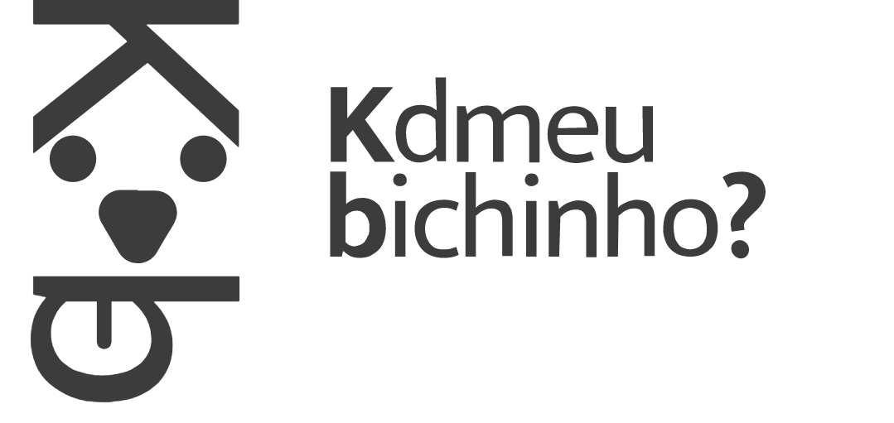
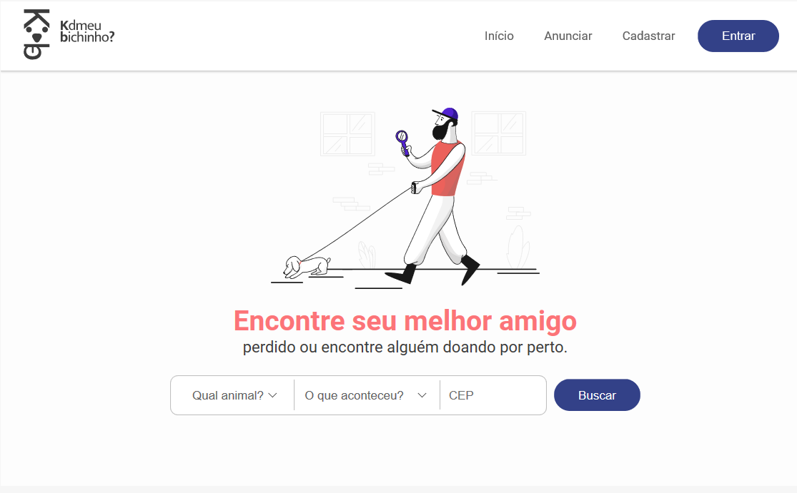
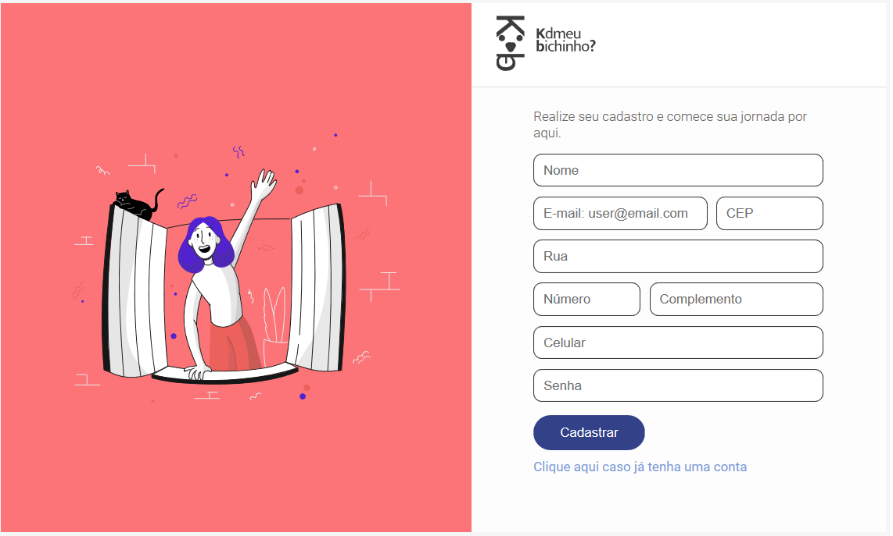
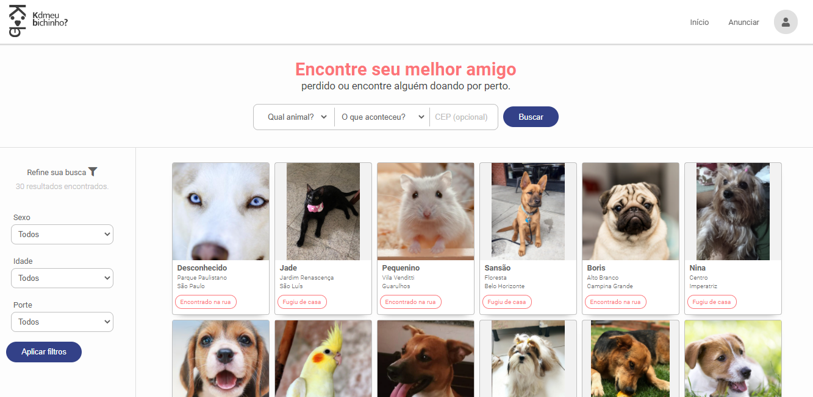

<br>
<h4 align="center">
 🚧  Kd meu bichinho? A plataforna ainda se encontra em fase de construção ✔️ 🚧
</h4>

## 💻 Sobre o projeto

:shipit: KdMeuBichinho? - O projeto surgiu com a missão de ajudar as pessoas que querem encontrar seu melhor amigo :dog: :cat: :rabbit:  que foi perdido ou encontrar alguém que está doando.

## :bulb: Ideia do Projeto

```bash
Realizar conexão entre interesses comuns das pessoas e os animais através de suas localizações.

- Pessoas que perderam seus animais e querem encontrá-los.
- Pessoas que encontraram animais perdidos e querem devolvê-los.
- Pessoas que têm animais para doar e adotar.

```

## 🖼 Screenshot das telas da aplicação

## 🖼 Tela principal da plataforma do KdMeuBichinho?

 

## 🖼 Tela de cadastro do usuário

<br>

<br>

## 🖼 Tela de anúncio dos animais

<br>

<br>

## 🛠 Tecnologias

As seguintes ferramentas foram usadas na construção do projeto:

### **Front-end**

<br>
<p align="left">
  <a href="https://developer.mozilla.org/pt-BR/docs/Web/HTML" target="_blank">
    
  </a>

  <a href="https://developer.mozilla.org/pt-BR/docs/Web/CSS" target="_blank">
    
  </a>
  <a
    href="https://developer.mozilla.org/en-US/docs/Web/JavaScript"
    target="_blank"
  >
    
  </a>
  
</p>

<br>

## 👷 Como rodar

```bash
# Clonar o repositório
git clone https://github.com/teteusAraujo/KdMeuBichinho.git

# Entrar numa IDE de sua preferência 

# Executar o servidor ou usar um puglin que criar um servidor

```

Feito isso, abra o seu navegador e acesse `http://localhost:5500/`
ou em uma porta de sua preferência.

## 🤔 Como contribuir <br/>

- Faça um fork desse repositório; <br/>
- Cria uma branch com a sua feature: `git checkout -b minha-feature`;<br/>
- Faça commit das suas alterações: `git commit -m 'feat: Minha nova feature'`; <br/>
- Faça push para a sua branch: `git push origin minha-feature`.<br/>
<br/>
Depois que o merge da sua pull request for feito, você pode deletar a sua branch. <br/>

## :mortar_board: Autores

<table align="center">
    <tr>
        <td align="center">
            <a href="https://github.com/teteusAraujo">
                
                <br />
                <sub><b>Mateus Araújo</b></sub>
            </a>
        </td>
    </tr>
</table>
<h4 align="center">
   Feito com 💜 by  <a href="https://www.linkedin.com/in/mateusaraujobarros/" target="_blank"> Mateus Araújo </a>
</h4>
